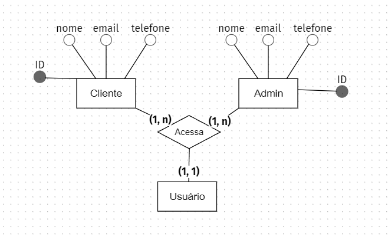
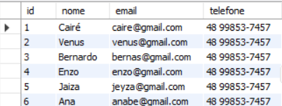

# Desafio Integrador - 12/04/2023

### Contexto
Uma empresa que fornece trabalhos manuais de diversos tipos. Esse novo empreendimento necessita de uma forma de acessar como cliente ou administrador. O administrador deve conseguir ver uma tabela que demonstra quantos clientes e suas informações tem, enquanto o cliente deve fazer um login para que as informações apareçam para o admnistrador.

### 1# Implantação de Sistemas:
- Descrever um problema sobre a UC. 
- Apresentar uma solução do problema. 

### 2# Banco de Dados:

- Descrever um contexto que envolva banco de dados.
A empresa necessita armazenas as informações dos clientes, também é necessario a edição, criação e exclusão dos mesmos. Este banco de dados tem que ser visivel para as pessoas com as permissões necessárias.

- Implementar todos os diagramas estudados em sala.

- Criar o modelo físico do banco de dados envolvendo apenas uma tabela. 

### 3# Desenvolvimento de Sistemas:
- Entregar projeto em Sprint Boot contendo front-end e back-end. 
- Entregar no mesmo projeto Sprint Boot, a classe em Java para descrever o problema. 

### 4# Proponha a Tela do App para Listar todos os item registrados no problema anterior.

- Descreva o App a ser prototipado e crie a ideia visual do protótipo.
Neste aplicativo, o usúario ira acessar e verá um header com hamburger-menu,  uma apresentação genérica da empresa, uma seção para selecionar o que ele é (Cliente ou Admin) e uma ultima aba fictica falando mais sobre a empresa e o que faz.
Ao clicar na aba de cliente ou admin, ele irá ter que fazer o login ou cadastro, com essas informações indo para o banco de dados. O cliente ao logar, continua no site normalmente, o administrador entrará em uma parte privada do site que mostra a tabela.

    <h2>Home & Login</h2>

- Implementar a classe em JS do domínio criado. 